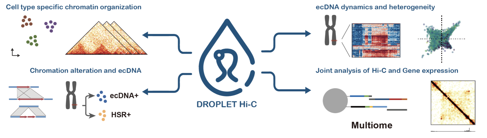

# Droplet Hi-C
This is a modified version of the [Droplet Hi-C processing pipeline](https://github.com/Xieeeee/Droplet-Hi-C), enhanced with parallelization support and more flexible script parameters.

#### Requirements:

*hictools*: compile from `Droplet-Hi-C/01.pre-process/scripts/hictools/` and put the binaries to your $PATH

*schicluster*: https://github.com/zhoujt1994/scHiCluster

*pairtools*: https://pairtools.readthedocs.io/en/latest/installation.html

Common NGS tools: *samtools, trim_galore, bwa, bgzip*

Python packages: *Anndata, cooler, scanpy, cutadapt, numpy, pandas, h5py*

R packages: *ggplot2, dplyr, scales, grid, R.utils, data.table, Matrix, dichromat, viridis, reshape2, ggbreak, patchwork*

#### Usage:

```shell
git clone https://github.com/zhaoshuoxp/Droplet-Hi-C.git
cd Droplet-Hi-C
```

Now edit the all the `preproc_paired_hic_v3.sh` shell scripts to change the path to bwa indexes of hg38 and mm10.

then run the whole process by:

```shell
cd <your working path having /fastq/sample_R1|2|3.fq.gz>
/path/to/Droplet-Hi-C/run -s <Sample prefix> -t <threads> -r <resolution 10,25,100> -g <genome, mm10 or hg38> -m <capture kit using, atac or arc >
```

##### Defaults

```shell
-s none
-t 24
-r 10
-g mm10
-m atac
```

# 

### Original README [https://github.com/Xieeeee/Droplet-Hi-C](https://github.com/Xieeeee/Droplet-Hi-C)

Droplet Hi-C is a cheap, convenient and scalable method for chromatin architecture profiling in single cells, based on the widely available 10X Chromium Single Cell ATAC platform.


🍹 This repository contains scripts and notebook to reproduce the results for our [manuscript](https://www.nature.com/articles/s41587-024-02447-1): **Droplet Hi-C enables scalable, single-cell profiling of chromatin architecture in heterogeneous tissues**

## Abstract
Comprehensive analysis of chromatin architecture is crucial for understanding the gene regulatory programs during development and in disease pathogenesis, yet current methods often inadequately address the unique challenges presented by analysis of heterogeneous tissue samples. Here, we introduce Droplet Hi-C, which employs a commercial microfluidic device for high-throughput, single-cell chromatin conformation profiling in droplets. Using Droplet Hi-C we mapped the chromatin architecture at single-cell resolution from the mouse cortex and analyzed gene regulatory programs in major cortical cell types. Additionally, we used this technique to detect copy number variation (CNV), structural variations (SVs) and the extrachromosomal DNA (ecDNA) in cancer cells, revealing clonal dynamics and other oncogenic events during treatment. We further refined this technique to allow for joint profiling of chromatin architecture and transcriptome in single cells, facilitating a more comprehensive exploration of the links between chromatin architecture and gene expression in both normal tissues and tumors. Thus, Droplet Hi-C not only addresses critical gaps in chromatin analysis of heterogeneous tissues but also emerges as a versatile tool enhancing our understanding of gene regulation in health and disease.




## [01.pre-process](https://github.com/Xieeeee/Droplet-Hi-C/tree/main/01.pre-process)
This directory contains scripts and analysis notebook for pre-processing (including mapping, contacts extraction, cells filtering) Droplet Hi-C data. 

## [02.analysis](https://github.com/Xieeeee/Droplet-Hi-C/tree/main/02.analysis)
This directory contains scripts and analysis notebook for re-producing figures in our manuscript. 

## 03.protocol
Protocol can be found at [protocol.io](https://www.protocols.io/view/droplet-hi-c-for-fast-and-scalable-profiling-of-ch-dpxe5pje).
