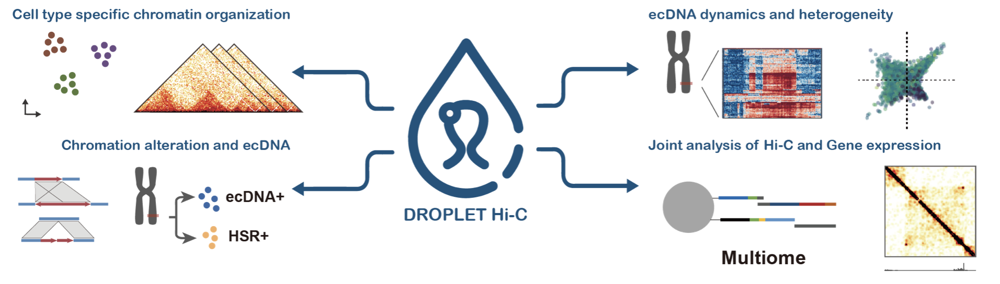

# scHi-C Analysis Pipeline

A streamlined Bash wrapper script to orchestrate the single-cell Hi-C (scHi-C) data processing pipeline. This script allows you to run the entire workflow end-to-end or selectively execute specific analysis steps. 

Modified from https://github.com/Xieeeee/Droplet-Hi-C

## Dependencies

Ensure the following tools are installed and available in your `$PATH`: `hictools`, `trim_galore`, `bwa`, `samtools`, `pairtools`, `bgzip`, `pairix`, `cooler`, `hicluster`, `hic-internal`.

## Usage

Bash

```
./run_pipeline.sh [-s sample] [-g genome] [-m mode] [-t threads] [-r resolutions] [-p steps] [-h]
```

### Options

- **`-s`** : Sample name *(Required)*
- **`-g`** : Reference genome (e.g., `mm10`, `hg38`) *(Required)*
- **`-m`** : Assay mode (e.g., `atac`, `arc`)
- **`-t`** : Number of threads to use *(Default: `24`)*
- **`-r`** : Resolution list, comma-separated *(Default: `10,50,100`)*
- **`-p`** : Pipeline steps to run, comma-separated *(Default: `all`)*
- **`-h`** : Show the help menu and exit

## Pipeline Steps (`-p`)

Use the corresponding numbers with the `-p` flag to run specific steps:

1. **`preproc_paired_hic`** - Raw data preprocessing
2. **`cell_filtering`** - Quality control and cell filtering
3. **`schic_impute`** - Data imputation
4. **`schic_gene_score`** - Gene score calculation
5. **`schic_domain`** - Domain calling
6. **`schic_loops`** - Loop calling

## Examples

**Run the complete pipeline:**

```
./run_pipeline.sh -s MySample -g hg38 -m atac -t 32 -r 10,50
```

**Run specific steps only (e.g., just Cell Filtering and Imputation):**

```
./run_pipeline.sh -s MySample -g hg38 -m atac -p 2,3
```

**View help:**

```
./run_pipeline.sh -h
```

## Modified Libraries & Environment

To support modern Python environments (Python 3.12+) and ensure stability with the latest scientific stack, we have included **custom-modified versions** of core libraries. These modifications address critical compatibility issues (e.g., NumPy 2.0 ABI changes, SciPy sparse matrix API updates).

### 1. schicluster (v0.1 modified)

We provide a patched version of `schicluster that is detached from git-scm versioning and explicitly adapted for:

- **NumPy >= 2.0.1**
- **SciPy >= 1.15.3**
- **pandas >= 2.3.3**
- **cooler >= 0.10.4**

**Installation:** Please install this modified version from the local source (do not install from PyPI):

https://github.com/zhaoshuoxp/scHiCluster/tree/master

> **Note:** We recommend installing these packages in **Editable Mode (`-e`)** inside a fresh conda environment to prevent conflicts with system-level packages.

### 2. hictools 

A patched version of `hictools` is provided to ensure compatibility with NovaSeq X and improved performance.

- **Zero-Copy Parsing (C++17):** Replaced all `std::string` allocations (`substr`, `split`, concatenation) with  `std::string_view`.
- **Pipeline to `kseq.h`:** Bypassed the single-threaded `zlib` by piping `pigz` output directly into Heng Li's  `kseq.h` C library.
- **OpenMP Parallelism:**  a batched-processing model using `#pragma omp parallel for`. Now reads chunks of 100,000 SAM lines and distributes workload uniformly across all available logical CPU cores.
- **Double Buffering & Aggregated I/O:** ses large 4MB custom memory buffers to aggregate processed data before flushing to disk, minimizing expensive system-level write calls.
- **One-Pass "End-to-End" Processing:** A new `end_to_end` module that integrates Barcode extraction, correction, and sequence reconstruction into a single execution step. This eliminates the need for massive intermediate files (`combined.fq.gz` and `.sam`), saving hundreds of GBs in disk I/O.
  - **In-Memory Hash Mapping (Bowtie-Free):** Implements a high-speed Bit-Encoded Hash Dictionary for 10X Barcodes.
  - **1-Mismatch Correction:** Automatically generates a 48-million-entry lookup table for all possible single-nucleotide variants. (equivalent to Bowtie `-m 1`) to ensure cellular identity integrity.
  - **Legacy Support:** Full backward compatibility is maintained for the original `combine_hic` and `convert_hic2` workflows.
  - 

**To compile:**

```
cd hictools_v2
g++ -O3 -std=c++17 -fopenmp hictools.cpp -o hictools
```


# Droplet Hi-C

Droplet Hi-C is a cheap, convenient and scalable method for chromatin architecture profiling in single cells, based on the widely available 10X Chromium Single Cell ATAC platform.

🍹 This repository contains scripts and notebook to reproduce the results for our [manuscript](https://www.nature.com/articles/s41587-024-02447-1): **Droplet Hi-C enables scalable, single-cell profiling of chromatin architecture in heterogeneous tissues**


## Abstract

Comprehensive analysis of chromatin architecture is crucial for understanding the gene regulatory programs during development and in disease pathogenesis, yet current methods often inadequately address the unique challenges presented by analysis of heterogeneous tissue samples. Here, we introduce Droplet Hi-C, which employs a commercial microfluidic device for high-throughput, single-cell chromatin conformation profiling in droplets. Using Droplet Hi-C we mapped the chromatin architecture at single-cell resolution from the mouse cortex and analyzed gene regulatory programs in major cortical cell types. Additionally, we used this technique to detect copy number variation (CNV), structural variations (SVs) and the extrachromosomal DNA (ecDNA) in cancer cells, revealing clonal dynamics and other oncogenic events during treatment. We further refined this technique to allow for joint profiling of chromatin architecture and transcriptome in single cells, facilitating a more comprehensive exploration of the links between chromatin architecture and gene expression in both normal tissues and tumors. Thus, Droplet Hi-C not only addresses critical gaps in chromatin analysis of heterogeneous tissues but also emerges as a versatile tool enhancing our understanding of gene regulation in health and disease.




## [01.pre-process](https://github.com/Xieeeee/Droplet-Hi-C/tree/main/01.pre-process)
This directory contains scripts and analysis notebook for pre-processing (including mapping, contacts extraction, cells filtering) Droplet Hi-C data. 

## [02.analysis](https://github.com/Xieeeee/Droplet-Hi-C/tree/main/02.analysis)
This directory contains scripts and analysis notebook for re-producing figures in our manuscript. 

## 03.protocol
Protocol can be found at [protocol.io](https://www.protocols.io/view/droplet-hi-c-for-fast-and-scalable-profiling-of-ch-dpxe5pje).
